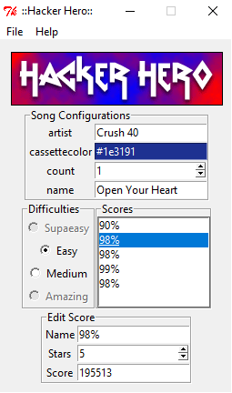

# Hacker Hero
A score editor for the game frets on fire

Made with python2 and tkinter.

<kbd></kbd>

## How to run:

First make the environment

```
conda env create -f "environment.yml"
```

Then run with these commands:

```
conda activate 2019_12_31-hacker_hero
python main.py
```

## Or...

Download binaries for windows
https://github.com/shuantsu/hacker_hero/releases
